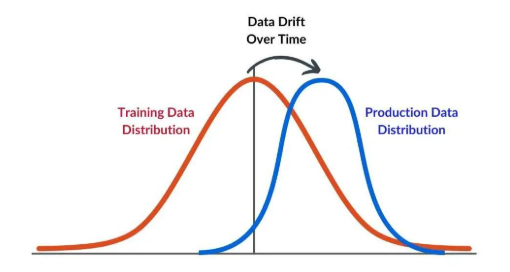
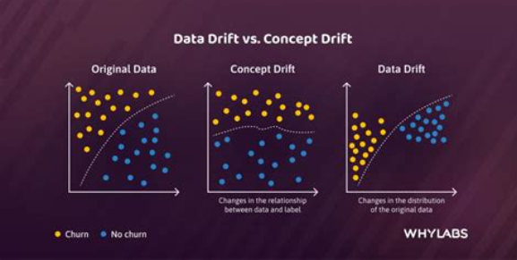
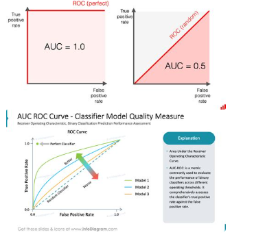

# Respostas — Métricas de Classificação e CRISP-DM

> **Nota:** respostas escritas com minhas próprias palavras e depois revisadas/aprimoradas no vocabulário com IA. A forma de explicar, as associações feitas e até respostas erradas ficam registradas aqui — errar pode acontecer, repetir não.

---

## 1. Diferença fundamental entre Acurácia e Recall em dados desbalanceados

A **acurácia** é a divisão entre o número total de previsões corretas e o número total de casos. Em dados desbalanceados, ela pode ser enganosa, pois o modelo pode acertar a maioria da classe dominante e ainda assim ter um desempenho ruim na identificação da classe minoritária.

Já o **recall** avalia, entre os casos que realmente pertencem à classe de interesse, quantos o modelo conseguiu identificar corretamente. Em um problema de inadimplência, por exemplo, o recall mostra quantos dos clientes realmente inadimplentes foram identificados pelo modelo, ajudando a reduzir os casos de inadimplentes classificados incorretamente como adimplentes.

**Resumo:** acurácia olha para todos os acertos, enquanto recall olha especificamente para quantos casos positivos reais o modelo conseguiu encontrar.

**Conceito de inadimplente:** pessoa ou empresa que não realizou o pagamento de uma dívida ou obrigação financeira dentro do prazo estabelecido.

---

## 2. Por que a Fase 3 (Data Preparation) demanda maior investimento de tempo?

A Fase 3 (Data Preparation) demanda maior investimento de tempo porque é nela que os dados são tratados e preparados para as etapas seguintes. É necessário identificar e corrigir erros, lidar com dados ausentes, inconsistentes ou duplicados, além de compreender profundamente o problema e a origem das informações.

Quando é identificado algum problema nas etapas posteriores, muitas vezes é necessário retornar à Data Preparation para revisar ou corrigir os dados. Por isso, essa fase pode ser mais demorada, pois envolve entender o problema, encontrar sua causa, definir uma solução viável e validar se as alterações não estão prejudicando outras etapas do processo.

---

## 3. Recall excelente no treino, péssimo no teste — a qual fase do CRISP-DM retornar?

A equipe deve retornar principalmente à **Fase 3 (Data Preparation)** para verificar se há problemas nos dados, como divisão inadequada entre treino e teste, dados desbalanceados, vazamento de dados ou características que estejam fazendo o modelo memorizar o conjunto de treinamento.

**Especificação dada por IA:** esse comportamento indica uma possível situação de **overfitting**, em que o modelo apresenta um desempenho excelente nos dados de treino, mas não consegue generalizar para dados que não viu durante o treinamento.

---

## 4. Data Drift e Concept Drift — em qual fase do CRISP-DM devem ser monitorados?

**Resposta errada (registrada como tentativa):** "Isso foi algo que passou batido pelos estudos, porém pelo nome imagino que seja a curva de dados real e conceitual, vulgo ROC/AUC."

**Resposta certa:**

**Data Drift** acontece quando a distribuição dos dados de entrada muda com o tempo em relação aos dados usados para treinar o modelo.

*Exemplo:* você treinou um modelo de inadimplência com clientes de 2025. Em 2026, começa a receber muitos clientes de um perfil diferente.

Na primeira imagem, por exemplo, a distribuição dos dados de treinamento e dos dados de produção se desloca. Isso representa bem a ideia de Data Drift.

**Concept Drift** acontece quando muda a relação entre as características (X) e o resultado que queremos prever (Y).

*Exemplo:* Cliente com determinada renda + determinado histórico → baixo risco de inadimplência (relação que pode deixar de valer com o tempo).

**ROC/AUC** é uma métrica/ferramenta de avaliação do classificador — não é a mesma coisa que Drift. A curva ROC relaciona a taxa de verdadeiros positivos com a taxa de falsos positivos para diferentes limiares de classificação.

